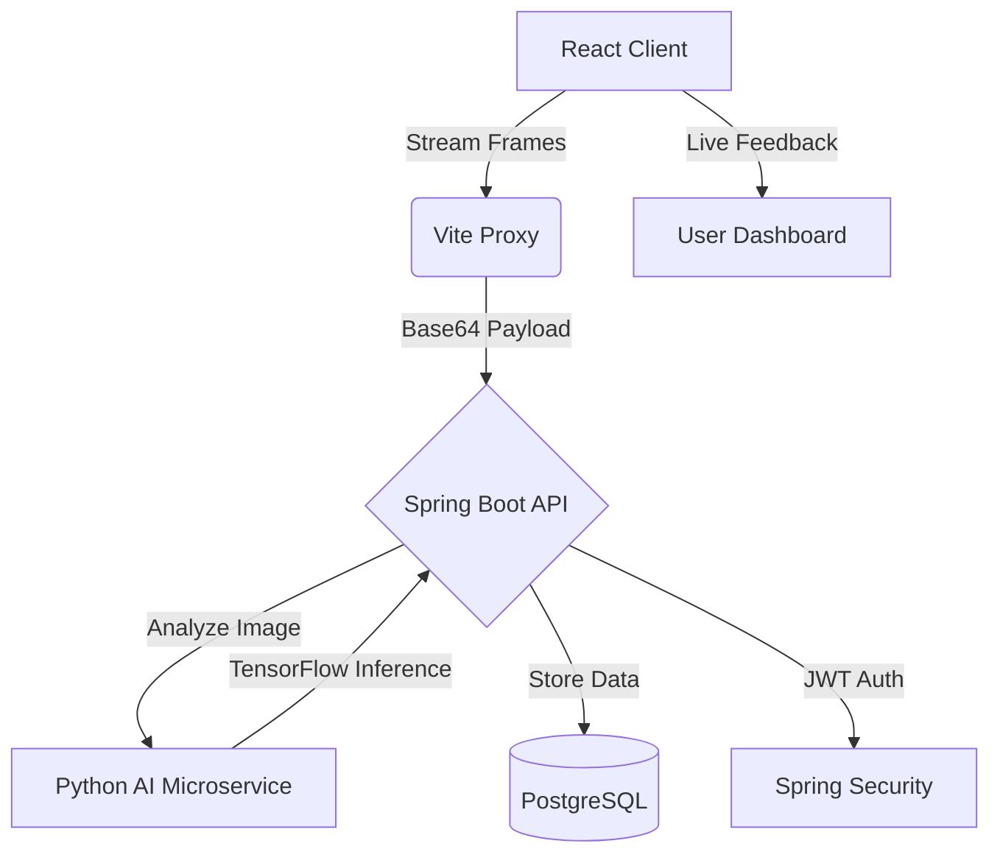

# ♻️ EcoBin: Intelligent AI Waste Management Ecosystem

[](https://reactjs.org/)
[](https://spring.io/projects/spring-boot)
[](https://www.tensorflow.org/)
[](https://opensource.org/licenses/MIT)

> **Empowering Sustainability through Neural Intelligence.** EcoBin is a cutting-edge, full-stack ecosystem designed to revolutionize personal waste management. By merging real-time AI computer vision with gamified incentives, we make responsible disposal an engaging, data-driven experience.

---

## 📖 Table of Contents
- [✨ Key Features](#-key-features)
- [🏗️ System Architecture](#️-system-architecture)
- [💻 Tech Stack](#-tech-stack)
- [🚀 Quick Start](#-quick-start)
- [🛠️ Configuration](#️-configuration)
- [📸 Preview](#-preview)
- [🛡️ Security & Privacy](#️-security--privacy)
- [🤝 Contributors](#-contributors)
- [📜 License](#-license)

---

## ✨ Key Features

### 🔍 Real-Time AI Classification
*   **Neural Scanning Box**: A high-precision "Laser Scanning" interface that crops and isolates objects from the background using real-time frame matrix transformations.
*   **Live Classification**: Instant categorization into *Biodegradable*, *Recyclable*, or *Non-Biodegradable* with high-confidence auto-confirmation.
*   **Background Exclusion**: Mathematical pixel-cropping logic ensures the AI focuses solely on the waste item, ignoring environmental clutter.

### 🎮 Gamified Eco-Impact
*   **EcoPoints System**: Earn points for every successful scan and proper disposal.
*   **Global Leaderboards**: Compete with other "Eco-Warriors" and track your rank in the community.
*   **Personal Dashboard**: Comprehensive analytics on your recycling habits, streaks, and total impact.

### 🔐 Enterprise-Grade Backend
*   **JWT Security**: Secure, stateless authentication with 24-hour session management.
*   **Admin Command Center**: Dedicated administrative interface for managing classification rules, user logs, and system analytics.
*   **Robust Fallback**: Intelligent keyword-matching taxonomy that takes over if the AI microservice experiences latency.

---

## 🏗️ System Architecture



---

## 💻 Tech Stack

### Frontend (User Experience)
*   **Core**: React 18, Vite (Fast HMR)
*   **State Management**: Redux Toolkit (Global), React Query (Server-State)
*   **Styling**: Tailwind CSS (Glassmorphism), Framer Motion (Fluid Animations)
*   **Icons**: Lucide React

### Backend (Business Logic)
*   **Framework**: Spring Boot 3
*   **Security**: Spring Security + JWT
*   **Persistence**: Hibernate/JPA + PostgreSQL
*   **Utilities**: Lombok, Maven

### AI Engine (Neural Processing)
*   **Processing**: Python, OpenCV (Image Matrixing)
*   **Model**: TensorFlow/Keras (`ecobin_model.keras`)
*   **API Layer**: Flask

---

## 🚀 Quick Start

### Prerequisites
*   Node.js (v18+)
*   Java JDK 17+
*   Python 3.9+
*   PostgreSQL Instance

### 1. Initialize the Neural Engine
```bash
cd Model
pip install -r requirements.txt
python app.py
```

### 2. Launch the Backend API
*Configure your DB credentials in `application.properties` first.*
```bash
cd EcoBin_Backend
# Run the provided startup script
./run_backend.bat
# OR via Maven
mvn spring-boot:run
```

### 3. Spin up the Frontend
```bash
cd EcoBin_Frontend
npm install
npm run dev
```

---

## 🛠️ Configuration

The system relies on environment variables or `application.properties`:

| Variable | Description |
| :--- | :--- |
| `SPRING_DATASOURCE_URL` | PostgreSQL Connection String |
| `JWT_SECRET` | 256-bit Secure key for token signing |
| `AI_MODEL_URL` | Endpoint of the Flask Microservice |
| `PORT` | Backend server port (Default: 8080) |

---

## 🛡️ Security & Privacy
*   **Stateless Auth**: All requests are protected via JWT.
*   **Data Integrity**: Bcrypt password hashing for all user accounts.
*   **Frame Privacy**: Captured frames for AI analysis are processed in-memory and subject to standard cleanup protocols.

---

## 🤝 Contributors

This project is a collaborative effort:
*   **Ayush**: Lead Developer (Frontend, Backend, & System Architecture)
*   **AI Engineering Partner**: AI Model Development & Neural Engine Integration

---

## 📜 License
Distributed under the MIT License. See `LICENSE` for more information.

---

**Developed with ❤️ by the EcoBin Team**
*Contributing to a Greener Future, One Pixel at a Time.*
